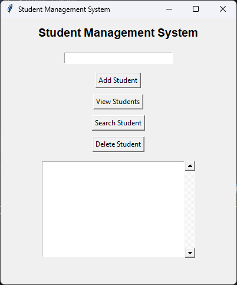
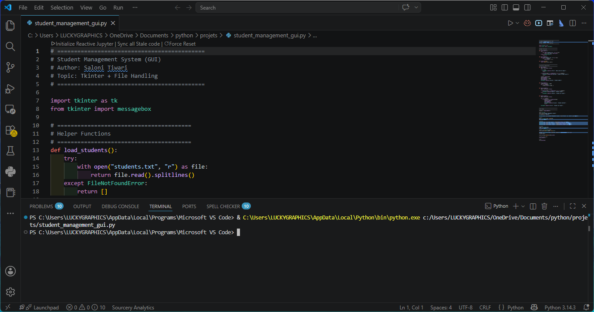

# 🎓 Student Management System (CLI + GUI)

A beginner-friendly Python project that demonstrates how to build a **Student Management System** using both:

- 💻 CLI Version (Terminal-based)
- 🖥️ GUI Version (Tkinter-based)

The system supports adding, viewing, searching, and deleting student records using persistent file storage with `students.txt`.

---

# 📌 Project Overview

This project was created to practice:

- Python programming fundamentals
- File handling (read/write)
- Tkinter GUI development
- Function-based programming
- Data persistence using text files

---

# ✨ Features

## ✅ CLI Version

- Add Student
- View Students
- Search Student
- Delete Student
- Duplicate prevention
- File-based storage

---

## ✅ GUI Version (Tkinter)

- User-friendly interface
- Add student records
- Search functionality
- Delete functionality
- Display all students
- Persistent storage using `students.txt`

---

# 🛠️ Technologies Used

- Python 3
- Tkinter
- File Handling
- Functions & Lists
- Git & GitHub

---

# 📂 Project Structure

```text
Student-Management-System/
│
├── student_management.py
├── student_management_gui.py
├── students.txt
├── student_management_system.png
├── student_management_terminal.png
└── README.md
```

---

# 🖼️ Project Screenshots

## 🖥️ GUI Version

<p align="center">
  
</p>

---

## 💻 CLI Version

<p align="center">
  
</p>

---

# ▶️ How to Run

## ✅ Run CLI Version

```bash
python student_management.py
```

---

## ✅ Run GUI Version

```bash
python student_management_gui.py
```

---

# 📄 students.txt Format

Each student name is stored on a new line.

Example:

```text
Rahul
Aisha
John Doe
```

---

# 📚 Learning Outcomes

By completing this project, I practiced:

- File handling in Python
- CRUD operations
- GUI development using Tkinter
- Event-driven programming
- Code organization using functions
- Data persistence

---

# 🚀 Future Improvements

- Add Student IDs
- Add Marks & Grades
- SQLite Database Integration
- Export to Excel/CSV
- Login Authentication
- Advanced GUI Styling

---

# 👩‍💻 Author

Saloni Tiwari  
Python & Data Science Student

---

⭐ If you like this project, feel free to star the repository!
